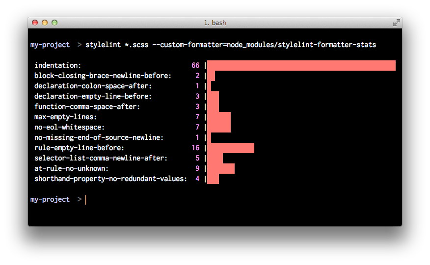

# Statistic Formatter for Stylelint

A statistic formatter for [Stylelint](https://stylelint.io/): analyse styles for error frequency, rather than location. This is particularly useful when introducing Stylelint to a legacy project.

## Install

    npm install -g stylelint
    npm install stylelint-formatter-stats

## Usage

### Stylelint CLI

    stylelint "src/**/*.scss" --custom-formatter=node_modules/stylelint-formatter-stats

## Related

* [eslint-stats](https://github.com/ganimomer/eslint-stats) – a statistic reporter for ESLint
